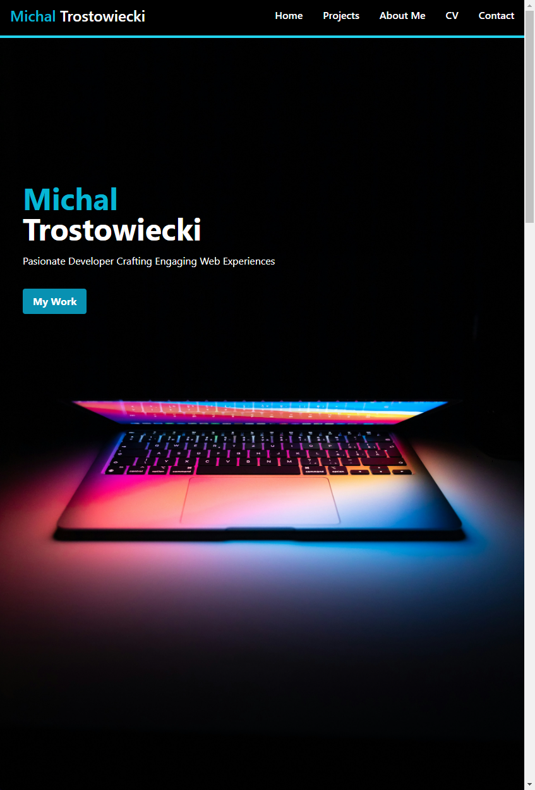
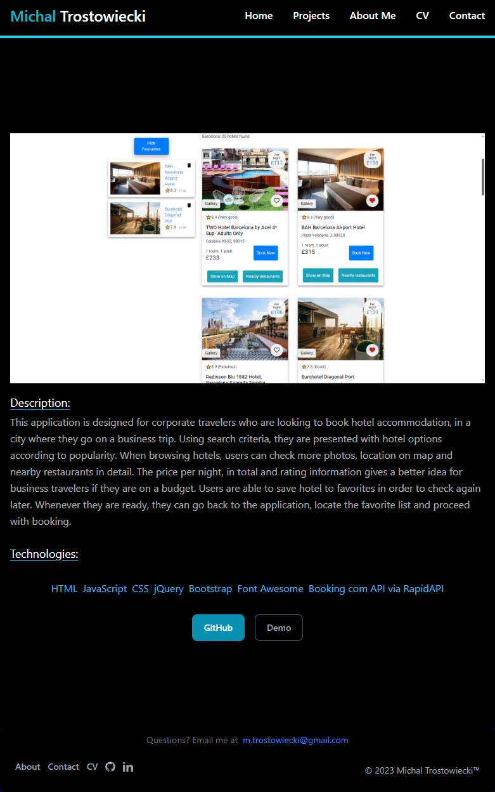

# My-portfolio-react

## Description

Welcome to my project showcase application! This application is designed to display a collection of my personal projects in a well-organized and visually appealing way. It's built using React and incorporates React Router for seamless navigation between different pages.

## Technologies Used

React, JSX, Javascript, HTML, CSS, TailWind CSS, Node, Netlify

## Screenshot

Deployed website : https://main--m-trostowiecki-portfolio.netlify.app/projects/1#

## Credits

N/A

## License

This project is licensed under the MIT License - see the [LICENSE](LICENSE) file for details.